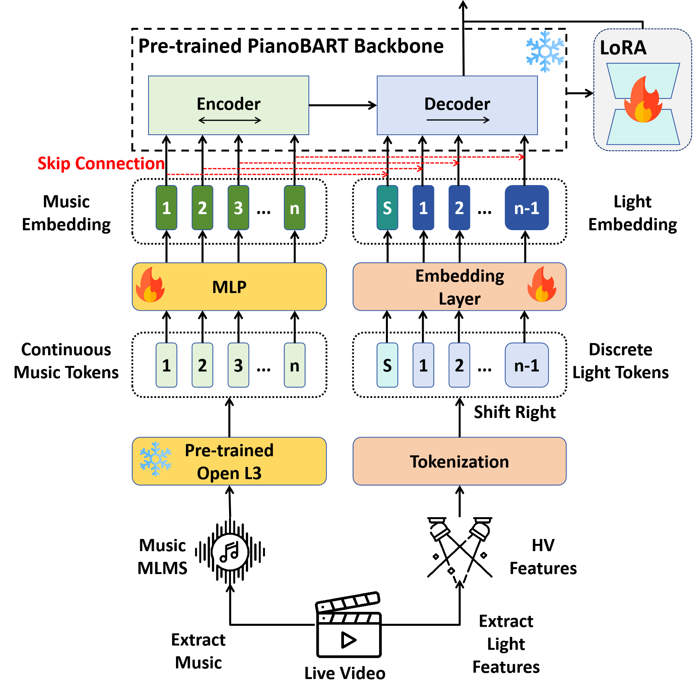

# ML-BART
**Article:** "Is Stage Lighting the Inspiration for Art or Mechanized Formula: A BART Inspired Approach" (under way)


## 1. Model Structure




## 2. Dataset: RPMC-L


## 3. How to Run

### 3. 1 Pre-train

```shell
python pretrain.py --gan
```


### 3.2 Fine-tune

```shell
python finetune.py --model_path <pre-training bart path>
```


### 3.3 Infer

```shell
python eval.py --bart_path <fine-tuned bart path > --head_path <classifier head path >
```


## 4. Generate Your Own Stage Light

```shell

```


## 5. Citation

```

```

